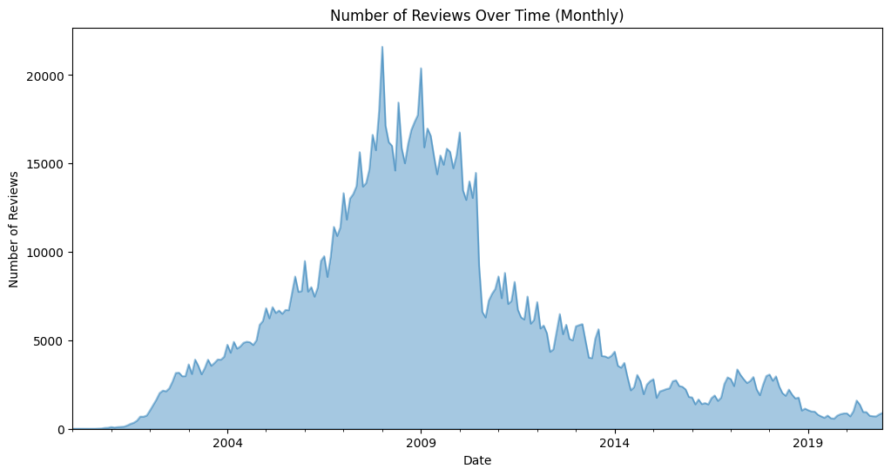

# Recipe Analysis | Python

I worked on this project to explore **recipe and review data** to uncover patterns in cooking trends, popular ingredients, and user ratings.  

You can view and run the [Colab notebook](https://colab.research.google.com/drive/1e4rrjxhUY0nuePGvtWImlfDvAl0ooG1H?usp=sharing).

## Project Overview
- Cleaned & transformed raw recipe and review data.  
- Classified missing categories using **Zero-Shot Classification (BART)**.  
- Performed **EDA**: category distribution, calorie trends, ingredient frequency.  
- Visualised patterns like review timelines and ratings vs. cook time.  

## Dataset
- **Original Source:** [Food.com Recipes & Reviews](https://www.kaggle.com/datasets/irkaal/foodcom-recipes-and-reviews)  
- **My Cleaned Dataset:** [Recipe Data (Kaggle Notebook)](https://www.kaggle.com/code/praneetharao/recipe-data)  

## Features  
✔ Cleaned and structured data (removed R-style vectors, formatted times).  
✔ Grouped 311 categories → **17 major categories**.  
✔ Predicted missing categories with HuggingFace **BART model**.  
✔ Visualised:  
  - Recipe distribution by category  
  - Average calories by category  
  - Cook time vs. rating  
  - Ingredient frequency (Bar & Word Cloud)  
  - Reviews over time  
✔ Identified top contributors and interesting recipes.

## Tech Stack  
- **Python:** Pandas, NumPy
- **Visualization:** Matplotlib, WordCloud
- **NLP:** HuggingFace Transformers (BART)

## 📊 Results

### 🔹 Top Ingredients  
Since most of the data contains recipes of desserts, the top ingredients include salt, butter, sugar, onion, and water.

### 🔹 Distribution of Recipes by Category  

### 🔹 Average Calories by Category  
Pie recipes have the highest average calories (~740.5), followed by Bread (~668.6) and Dessert (~616.9).

### 🔹 Reviews Over Time  
The number of reviews submitted peaked around 2008 and 2009 and has decreased over the years.

